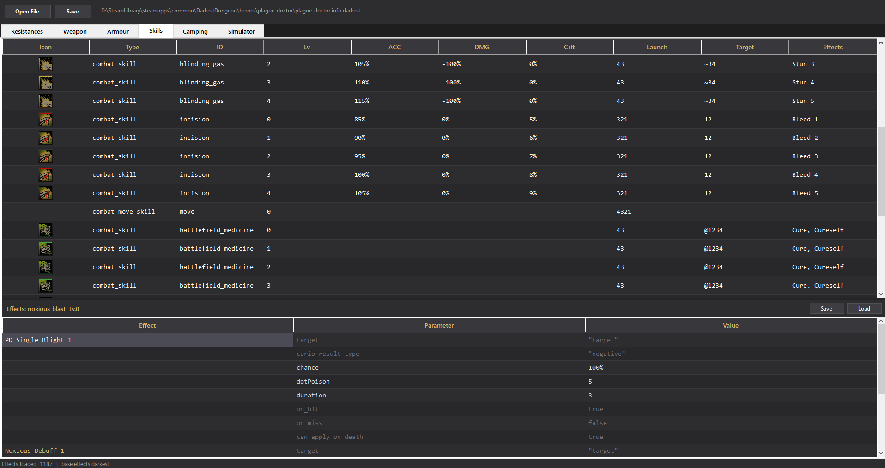
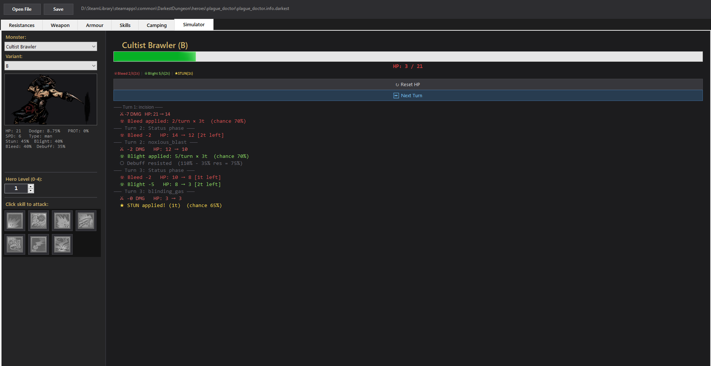

# DarkestStatChanger

A stat editor and combat simulator for Darkest Dungeon heroes and mods.
Load any hero's `.info.darkest` file to view and edit stats, skills, and effects — then test the results in the built-in simulator.

---

## Requirements

- Windows 10 or later
- [.NET Framework 4.7.2](https://dotnet.microsoft.com/en-us/download/dotnet-framework/net472) or later (usually already installed on most PCs)

---

## Getting Started

1. Extract the zip file anywhere on your PC.
2. Run `DarkestStatChanger.exe`.
3. Drag and drop a hero's `.info.darkest` file onto the window, or click **Open** to browse for one.
   - Example: `Darkest Dungeon\mods\lilithMode\heroes\lilith\lilith.info.darkest`

---

## Tabs

### Stats Tab
Displays the hero's resistances and weapon/armour scaling per upgrade level.

| Section | What you can edit |
|---|---|
| Resistances | Stun, Poison, Bleed, Disease, Move, Debuff, Death Blow, Trap |
| Weapon | ATK%, DMG (low/high), Crit% per level |
| Armour | DODGE, HP per level |

Click any cell to edit it, then click **Save** to write changes back to the file.
A `.bak` backup is created automatically before saving.

---

### Skills Tab
Lists all combat skills with their icon, level, ATK%, DMG range, Crit%, launch slots, and target slots.

**Editing skills:**
Click any cell to edit it directly. Click **Save** when done.

**Skill icons:**
Icons are loaded automatically if the ability PNG files are in the same folder as the `.info.darkest` file.
Supported naming conventions:
- `hero.ability.one.png`, `hero.ability.two.png`, ...
- `hero.ability.1.png`, `hero.ability.2.png`, ...

**Effects panel (bottom half of the Skills tab):**
Click any skill row to see the effects that skill uses at the currently displayed level.

- If no effects file is loaded, the panel shows which effect names are referenced but unavailable.
- Click **Load Effects File** to load the mod's `*.effects.darkest` file.
  - Example: `lilithMode\effects\lilith.effects.darkest`
- After loading, all parameters for each effect are shown in the **Effect / Parameter / Value** table.
- Edit any value in the **Value** column, then click **Save Effects** to write changes back.
- A `.bak` backup of the effects file is created automatically.

> The effects panel reads all parameters dynamically, so it works with any mod regardless of what custom parameters it uses.

---

### Camping Skills Tab
Lists all camping skills with their cost, use limit, and effects summary.
Editing works the same as the Skills tab — click a cell, edit, then Save.

---

### Simulator Tab
Test how a hero's skills perform against a selected monster.
Note that this simulator does not perfectly replicate Darkest Dungeon's damage formulas — results may vary. It is intended for rough reference only. Mod-specific mechanics are not simulated.

**Setup:**
1. Load a hero file first — the simulator uses the currently loaded hero.
2. Select a monster type and variant from the dropdowns.
3. Set the hero level with the spinner (affects ATK and DMG scaling).
4. Click a skill icon to select which skill to use.

**Running the simulation:**
- Click **Next Turn** to simulate one turn.
  - The selected skill hits the monster and applies damage.
  - DoT (Bleed/Blight) and status effects (Stun, Debuff) are tracked and ticked each turn automatically.
- The HP bar shows the monster's current HP.
- The status line below the bar shows active effects color-coded:
  - **Red** — Bleed
  - **Green** — Blight
  - **Yellow** — Stun
  - **Purple** — Debuff
- The log panel on the right records every event turn by turn.
- Click **Reset** to start over with a fresh monster.

> ATK, DMG, and Crit values come from the hero file. Resistance checks (Stun resist, Debuff resist, etc.) use the monster data bundled with the app.

---

## Saving

- **Save** (top bar) — saves the currently loaded `.info.darkest` file.
- **Save Effects** (Skills tab) — saves changes to the loaded `*.effects.darkest` file.
- Both create a `.bak` backup in the same folder before overwriting.

---

## Notes

- Only the file you explicitly opened is ever modified. Nothing else is touched.
- If skill icons do not appear, make sure the PNG files are in the same folder as the `.info.darkest` file and follow the naming pattern above.
- The effects panel only shows effects referenced by the selected skill at the current level. Make sure to load the correct mod's effects file.

---
---

# DarkestStatChanger (한국어)

다크에스트 던전 영웅 및 모드의 스탯 편집기 및 전투 시뮬레이터입니다.
영웅의 `.info.darkest` 파일을 불러와 스탯, 스킬, 이펙트를 확인하고 수정한 뒤, 내장 시뮬레이터로 결과를 테스트할 수 있습니다.

---

## 실행 요구사항

- Windows 10 이상
- [.NET Framework 4.7.2](https://dotnet.microsoft.com/en-us/download/dotnet-framework/net472) 이상 (대부분의 PC에는 이미 설치되어 있음)

---

## 시작하기

1. 압축 파일을 원하는 위치에 압축 해제합니다.
2. `DarkestStatChanger.exe`를 실행합니다.
3. 영웅의 `.info.darkest` 파일을 창에 끌어다 놓거나, **Open** 버튼으로 직접 열 수 있습니다.
   - 예시: `Darkest Dungeon\mods\lilithMode\heroes\lilith\lilith.info.darkest`

---

## 탭 설명

### Stats 탭
영웅의 저항력과 무기/방어구의 업그레이드 단계별 수치를 표시합니다.

| 항목 | 편집 가능한 내용 |
|---|---|
| Resistances | 기절, 중독, 출혈, 질병, 이동, 디버프, 데스블로우, 함정 저항 |
| Weapon | 공격%, 피해량(최소/최대), 치명타% (레벨별) |
| Armour | 회피, HP (레벨별) |

셀을 클릭해 값을 수정한 후 **Save**를 클릭하면 파일에 저장됩니다.
저장 전에 `.bak` 백업 파일이 자동으로 생성됩니다.

---

### Skills 탭
모든 전투 스킬을 아이콘, 레벨, 공격%, 피해 범위, 치명타%, 발동 슬롯, 타겟 슬롯과 함께 목록으로 표시합니다.

**스킬 편집:**
그리드의 셀을 직접 클릭해 수정하고, 완료 후 **Save**를 클릭합니다.

**스킬 아이콘:**
`.info.darkest` 파일과 같은 폴더에 능력 PNG 파일이 있으면 자동으로 불러옵니다.
지원하는 파일명 규칙:
- `hero.ability.one.png`, `hero.ability.two.png`, ...
- `hero.ability.1.png`, `hero.ability.2.png`, ...

**이펙트 패널 (Skills 탭 하단):**
스킬 행을 클릭하면 현재 표시된 레벨 기준으로 해당 스킬이 사용하는 이펙트 목록이 표시됩니다.

- 이펙트 파일이 로드되지 않은 경우, 참조된 이펙트 이름과 함께 경고가 표시됩니다.
- **Load Effects File** 버튼을 클릭해 모드 폴더의 `*.effects.darkest` 파일을 불러옵니다.
  - 예시: `lilithMode\effects\lilith.effects.darkest`
- 파일이 로드되면 각 이펙트의 모든 파라미터가 **Effect / Parameter / Value** 테이블에 표시됩니다.
- **Value** 열의 값을 수정한 후 **Save Effects**를 클릭하면 원본 파일에 저장됩니다.
- 저장 전에 `.bak` 백업 파일이 자동으로 생성됩니다.

> 이펙트 패널은 모든 파라미터를 동적으로 읽기 때문에, 어떤 모드의 커스텀 이펙트 파일도 별도 수정 없이 지원됩니다.

---

### Camping Skills 탭
모든 캠핑 스킬을 비용, 사용 횟수 제한, 이펙트 요약과 함께 목록으로 표시합니다.
편집 방법은 Skills 탭과 동일합니다 — 셀 클릭 후 수정, 저장.

---

### Simulator 탭
선택한 몬스터를 상대로 영웅 스킬의 성능을 테스트합니다.
해당기능은 DarkestDungeon의 데미지 산출 방식과 완벽히 동일한 것은 아니며 차이가 있을 수 있으니 대략적인 수치만 확인해보는 용도입니다.
각 모드 고유의 기능들은 확인하실 수 없습니다.

**설정:**
1. 먼저 영웅 파일을 불러옵니다 (시뮬레이터는 현재 로드된 영웅 데이터를 사용합니다).
2. 드롭다운에서 몬스터 종류와 변형을 선택합니다.
3. 숫자 입력기로 영웅 레벨을 설정합니다 (공격% 및 피해량 스케일링에 영향).
4. 스킬 아이콘을 클릭해 사용할 스킬을 선택합니다.

**시뮬레이션 진행:**
- **Next Turn**을 클릭하면 1턴이 진행됩니다.
  - 선택한 스킬이 몬스터에게 피해를 입힙니다.
  - 스킬에 DoT(출혈/독) 또는 상태이상(기절, 디버프) 효과가 있으면 매 턴 자동으로 추적 및 적용됩니다.
- HP 바가 몬스터의 현재 HP를 보여줍니다.
- HP 바 아래 상태 표시줄이 활성 효과를 색상으로 구분합니다:
  - **빨간색** — 출혈 (Bleed)
  - **초록색** — 독 (Blight)
  - **노란색** — 기절 (Stun)
  - **보라색** — 디버프 (Debuff)
- 오른쪽 로그 패널에 매 턴의 모든 이벤트가 기록됩니다.
- **Reset**을 클릭하면 몬스터가 초기 상태로 돌아갑니다.

> 공격%, 피해량, 치명타%는 영웅 파일에서 읽어오며, 저항 판정(기절 저항, 디버프 저항 등)은 앱에 내장된 몬스터 데이터를 사용합니다.

---

## 저장

- **Save** (상단 바) — 현재 열려 있는 `.info.darkest` 파일을 저장합니다.
- **Save Effects** (Skills 탭) — 로드된 `*.effects.darkest` 파일에 변경 사항을 저장합니다.
- 두 경우 모두 덮어쓰기 전에 같은 폴더에 `.bak` 백업 파일이 자동 생성됩니다.

---

## 참고 사항

- 직접 열기로 지정한 파일만 수정됩니다. 그 외 파일은 일절 건드리지 않습니다.
- 스킬 아이콘이 표시되지 않으면, PNG 파일이 `.info.darkest` 파일과 같은 폴더에 있는지, 파일명 규칙을 따르는지 확인하세요.
- 이펙트 패널은 현재 레벨의 선택된 스킬에서 참조하는 이펙트만 표시합니다. 올바른 모드의 이펙트 파일을 로드해야 전체 내용을 볼 수 있습니다.
